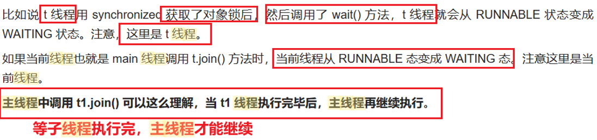
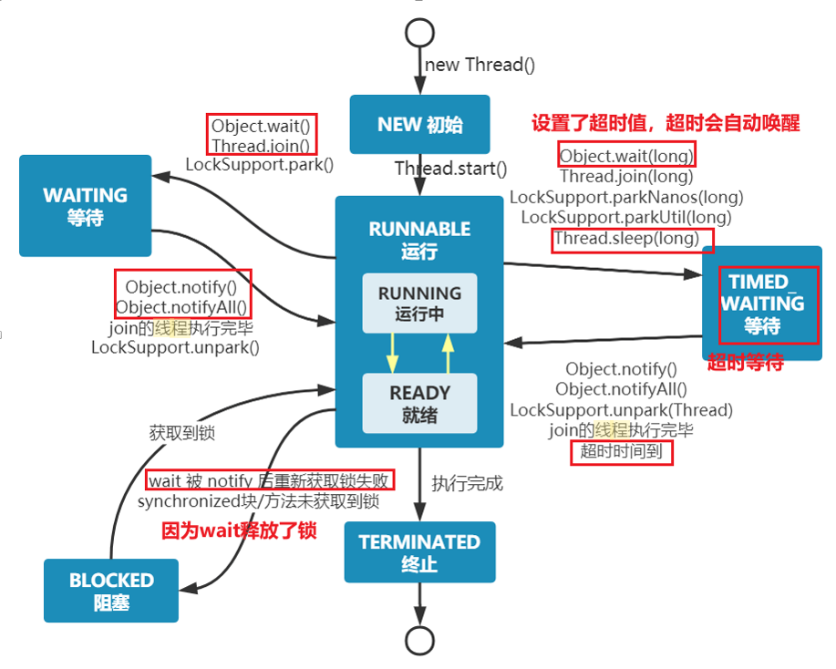
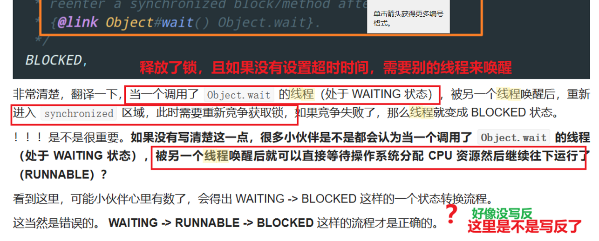

# 1.JUC并发编程
## 什么是JUC
java中处理线程的一个工具包

## 线程和进程的区别？(what)
- 进程是资源分配的基本单位
- 线程是调度（分配处理器时间）的基本单位，是线程的执行单元
- 一个进程包含一个或多个线程，同一个进程下的线程共享内存空间（在 windows
  中进程是不活动的，只是作为线程的容器）
- 线程是轻量级的进程，线程的上下文切换成本比进程低
  - why
    - 因为同一进程下的线程共享资源空间和地址空间，上下文切换的时候不需要切换内存地址空间，也不需要打开关闭资源，因此成本更小，
    - 进程间通信需要额外的机制来实现，如管道、信号量、消息队列等。
      线程间通信可以直接通过共享内存等方式进行，通常更为高效。


## 如何创建一个线程？（how)
> 本质上创建线程的方法只有一个
> - new Thread()
> - 实现Runnable接口和callable接口并且重写run方法知识获取到了任务对象，将任务对象传递给线程的同时也调用了new thread来创建对象
- 举例：
  - ``` java
    //1.继承thread类
    class MyThread extends Thread {
      public void run() {
      // 线程执行的任务
      }
    }
    public class Main {
      public static void main(String[] args) {
        MyThread thread = new MyThread();
        thread.start();
      }
    }
    //2.实现接口：
    class MyRunnable implements Runnable {
      public void run() {
          // 线程执行的任务
      }
    }

    public class Main {
      public static void main(String[] args) {
        MyRunnable myRunnable = new MyRunnable();
        Thread thread = new Thread(myRunnable);
        thread.start();
        }
    }
    ```
  ### 为什么继承thread类看起来好像已经能够满足需求了，为什么还要实现runnable或者callable接口呢？（why）
 
  1. **避免单继承局限性：** Java是单继承的，如果你的类已经继承了另一个类，就不能再继承Thread类。
     - 这就限制了你的类不能同时继承其他类和具有线程功能。通过实现Runnable接口，你可以在不受单继承限制的情况下为类添加线程行为。

  2. **更好的面向对象设计：** 使用Runnable接口或Callable接口创建线程更符合面向对象设计原则中的组合优于继承原则。
     - 通过将线程代码与主类分离，可以更好地实现代码的模块化。

  3. **线程池的使用：** 当你使用线程池来管理线程时，通常会将Runnable对象提交给线程池而不是Thread对象。
     - 这样可以更好地控制线程的生命周期，并且可以重用线程，提高性能。

  4. **可共享线程资源：** 如果你想要多个线程共享同一个Runnable实例，
     - 那么使用实现Runnable接口创建线程会更加方便。

### Runnable接口和Callable接口的区别？（what）
  在Java中，实现Runnable接口和实现Callable接口都可以用来创建线程，但它们有几个关键区别：

1. **返回值类型：**
  - **Runnable接口：** Runnable接口的run()方法没有返回值，通常用于执行一些没有返回结果的线程任务。
  - **Callable接口：** Callable接口的call()方法可以返回一个泛型类型的结果，并且允许抛出异常。它的返回值类型由泛型参数指定，允许线程任务执行完成后返回一个结果。

2. **异常处理：**
  - **Runnable接口：** run()方法不能抛出受检查异常，因此在实现Runnable接口时，你必须在run()方法内部处理所有可能抛出的受检查异常。
  - **Callable接口：** call()方法可以抛出受检查异常，因此在实现Callable接口时，你可以声明call()方法可能会抛出的受检查异常，并让调用方进行处理。

3. **线程任务完成状态：**
  - **Runnable接口：** 在使用Runnable接口创建的线程任务执行完成后，无法获取任务的执行结果。
  - **Callable接口：** 在使用Callable接口创建的线程任务执行完成后，可以通过Future对象获取任务的执行结果，也可以通过Future对象判断任务是否完成、取消等状态。

4. **使用场景：**
  - **Runnable接口：** 适用于那些只需要执行一些操作而不需要返回结果的线程任务。
  - **Callable接口：** 适用于那些需要执行一些操作，并且希望获取执行结果的线程任务，或者需要处理可能抛出受检查异常的情况。

#### 延伸
  - 为什么Runnable没有返回值？
  > 这种设计是为了简化线程的使用和管理。如果Runnable接口定义了有返回值的方法，那么就需要在执行线程任务后返回一个结果，这样会增加调用者和线程之间的耦合性，同时也增加了线程的管理和同步复杂度。 

  > 另外，Java提供了Callable接口来支持具有返回值的线程任务，它的call()方法可以返回一个泛型类型的结果，这种设计更加灵活，可以满足需要返回结果的线程任务的需求。因此，如果需要线程执行完毕后返回结果，可以使用Callable接口来实现。


## java真的能开启一个线程吗(how)
- 开启线程的方法 new thread.start()**[创建之后才能打开]**
  - 底层调用的是start0，是native本地方法，底层是c++实现的，java无法直接操作硬件
- start方法和run方法的区别？（what）
  - start方法里面调用run方法，并执行了run定义的方法，start方法只执行一次
  - 而run可以被执行多次


## 控制线程的方法（how)
- 控制线程，也就是让线程的状态改变
  - Object.wait（），Thread.join（），sleep()
    - wait()和join的区别
    - 


## 线程状态切换图（what）

- 注意细节：
- 


## 锁

### 理清楚锁的对象到底是谁（？）