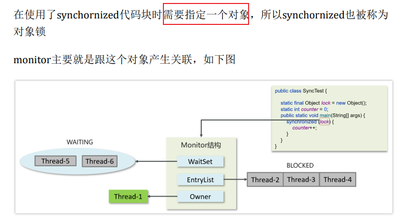
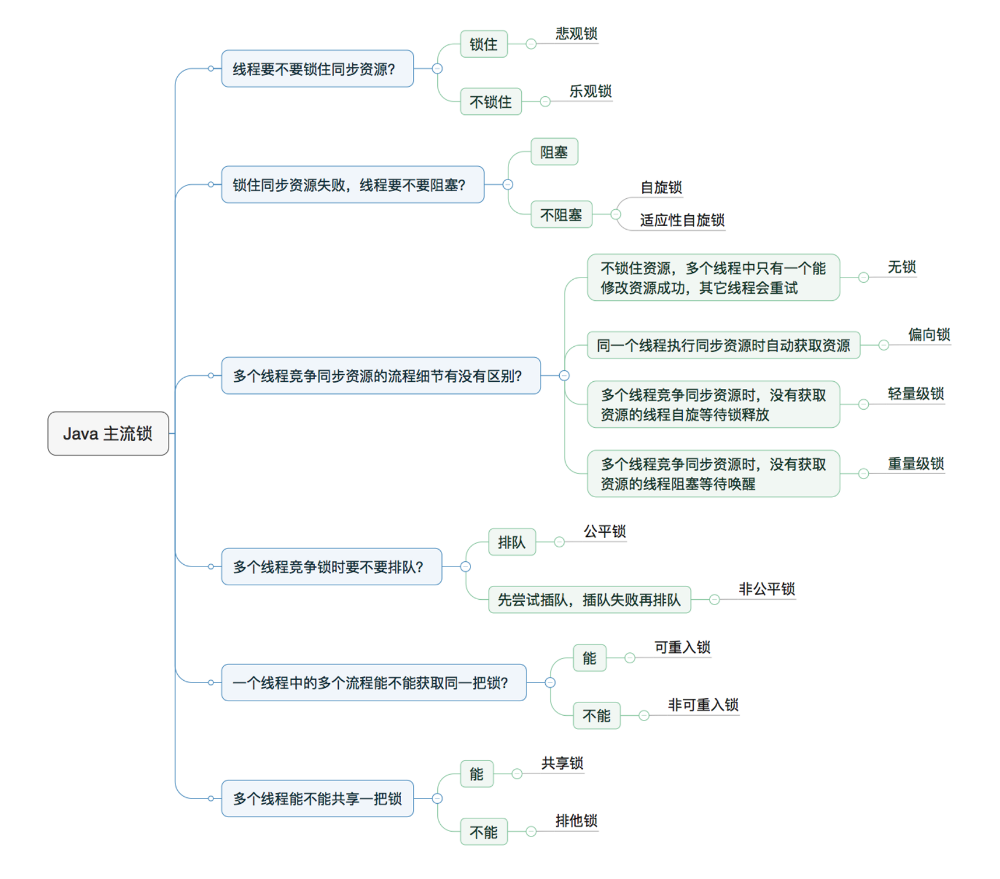

# 2.锁-一种同步机制

## 锁是什么
- 一种同步机制
- 用于控制对共享资源的访问，确保在任何时候只有一个线程可以访问该资源。
- 锁能够保证线程安全，防止多个线程同时访问共享资源时产生的数据不一致问题。
- **synchronized实现同步的基础：Java中的每一个对象都可以作为锁**
  - (why）因为每个对象都有一个monitor
    - 在Java中，任何对象都可以作为锁是因为Java中的锁实际上是通过对象的监视器（Monitor）来实现的。每个对象都有一个与之关联的监视器，这个监视器可以用来实现同步和互斥访问。因此，当我们使用`synchronized`关键字或`Lock`接口时，实际上是在操作对象的监视器，而不是对象本身。

   > 这种设计带来了一些优势：

   1. **灵活性**：因为任何对象都可以作为锁，所以可以根据具体的需求选择合适的对象作为锁，**而不需要额外创建特定的锁对象**。

   2. **封装性**：通过将同步操作封装在对象内部，**可以更好地实现数据的封装和保护**，同时简化了并发编程的复杂性。

  3. **自然性**：使用对象作为锁符合面向对象编程的思想，使得**同步机制与对象的状态和行为相关联**，更加自然和直观。

- 理清楚锁的对象到底是谁

## 锁的两套机制Synchornized和Lock接口

> Java中的并发编程主要通过两种方式来实现：使用关键字`synchronized`和使用`Lock`接口。

1. **synchronized**：
   - `synchronized` 是 Java 中的关键字，**不能被继承** 用于实现同步代码块或方法。
   - 当一个线程进入`synchronized`代码块或方法时，它会尝试获得对象的锁。如果锁已经被其他线程持有，该线程将被阻塞，直到锁被释放。
   - `synchronized` 关键字内置了锁的获取和释放机制，使得编程更加简单，但也可能导致性能问题，因为一旦一个线程持有了锁，其他线程就无法访问被锁定的代码块或方法。

2. **Lock接口**：
   - `Lock` 接口提供了更加灵活的锁定机制，相比于`synchronized`，它提供了更多的功能和控制。
   - `Lock` 接口的实现类包括 `ReentrantLock`、`ReentrantReadWriteLock`等。
   - 使用`Lock`接口可以实现更灵活的锁定机制，比如支持公平性，可中断性，尝试获取锁等待一段时间（避免死锁），以及支持多个条件变量等功能。
   - 与`synchronized`相比，`Lock`接口的主要优势在于提供了更多的控制和功能，但使用时需要注意锁的获取和释放，确保在适当的时候释放锁以避免死锁等问题。

## 谈谈synchronized与Lock锁的区别：

- 首先synchronized是**Java内置关键字，在JVM层面，Lock是个Java类**；
- **锁状态**：synchronized**无法判断是否获取锁的状态，Lock可以判断是否获取到锁**；
- **自动释放**：**synchronized会自动释放锁**(线程执行完同步代码块或同步方法后会自动释放锁，**即使线程执行过程中发生异常也会自动释放锁**)，Lock需要线程在finally代码块中**手动调用unlock()方法释放锁**，以确保锁被正确释放，否则容易造成线程死锁；
- **独占与共享**：synchronized**只能实现独占锁**，而lock可以实现独占锁和共享锁，共享锁(读锁)可以让多个线程同时访问共享资源，从而提高程序的并发性能。
    > 即同一时间只能有一个线程获取到锁并访问共享资源，其它线程需要等待
- **阻塞与非阻塞**：用synchronized关键字的两个线程：线程1和线程2，如果当前线程1获得锁，则线程2等待；如果线程1获得锁后阻塞，线程2也会一直等待下去。等待锁的释放。而Lock锁就不一定会等待下去，`lock.tryLock()`方法用于尝试获取锁。它尝试获取锁，如果获取成功，就立即返回true，这样线程可以继续执行后续操作。如果获取失败，就立即返回false，不会阻塞线程。
  与lock()方法不同的是，`tryLock()方法`可以避免线程因等待无法获取锁而被阻塞的情况，因此，对于实时系统和高性能的应用程序来说，tryLock()方法更具有实用性和可应用性。

## 对象头一开始就有一个Monitor跟它关联吗？
1. 在 Java 中，每个对象在创建时并不会立即关联一个 monitor。相反，monitor 是在对象第一次被线程访问时动态创建的。这个过程通常称为懒汉式实例化（Lazy Initialization）。

2. 当第一个线程尝试进入一个对象的 `synchronized` 方法或代码块时，Java 虚拟机会检查该对象是否已经有与之关联的 monitor。如果没有，它会动态地为该对象创建一个 monitor，并将其关联到对象的头部。然后，该线程将获取这个新创建的 monitor 的锁，继续执行 `synchronized` 代码块。这样，对象的 monitor 就会在需要的时候才被创建。
3. 一旦 monitor 被创建并关联到对象头后，它将一直存在，直到对象被销毁。在对象的整个生命周期中，它的 monitor 负责管理对象的同步访问，包括锁的获取和释放，以及内部计数器的维护。

## 如果从来没有一个线程尝试进入一个对象的 synchronized 方法或代码块，那么对象是不是就没有monitor相关联？
- 是的，如果从未有线程尝试进入一个对象的 synchronized 方法或代码块，那么对象可能就没有与之关联的 monitor。
- 在 Java 中，monitor 是在对象第一次被线程访问时动态创建的，通常称为懒汉式实例化。

## Monitor一开始就跟同步代码块关联吗
- Monitor应该是不跟同步代码块关联的
- 虽然对象不是一创建就有Monitor，但是一旦管理就一直存在有Monitor

## 那为什么还说每个对象都关联一个Monitor呢？
- 你提出的问题很有意思。事实上，我可能过于笼统地表达了这一点。
- 每个对象在Java中都有潜在的能力与一个监视器关联，但这种关联只会在需要同步访问对象时才会实际发生。
- 换句话说，每个对象都有可能关联一个监视器，但并不是在对象创建时就立即关联。
- 关联是在对象上第一次执行同步操作时动态创建的。如果对象从未被用于同步，那么它就不会关联任何监视器。这种动态关联监视器的机制确保了在需要同步时才会消耗额外的系统资源。

## synchronized底层原理
`synchronized` 是 Java 中用于实现线程同步的关键字。它的底层原理涉及到 Java 对象头中的一些标记位和相关的锁机制和指令原语等。

> 1. 在 Java 中，每个对象都有一个与之相关联的监视器（monitor）。当一个线程进入一个 `synchronized` 方法或代码块时，
它首先尝试获取对象的监视器锁。如果锁是空闲的（锁计数器为0），那么线程将获得锁并继续执行代码，同时将锁标记为被占用（锁计数器加1）。如果锁已经被另一个线程占用，那么该线程将被阻塞，直到锁被释放。
> 2. 线程试图获取锁也就是获取监视器 monitor 的持有权
> 3. 监视器中的内部计数器用于记录当前持有锁的线程数。每当一个线程进入 `synchronized` 方法或代码块时，计数器会递增；当线程退出 `synchronized` 方法或代码块时，计数器会递减。当计数器为零时，锁将被释放。

> 3. synchronized最开始是**重量级**锁，优化之后引入了偏向锁，轻量级锁等机制

## Monitor的内部
- Owner：存储当前获取锁的线程的，只能有一个线程可以获取
- EntryList：关联没有抢到锁的线程，处于Blocked状态的线程
- WaitSet：关联调用了wait方法的线程，处于Waiting状态的线程

### 执行流程
   - 代码执行到Synchronized同步代码块，Monitor对象中的Owner是否已经有线程了
     - 如果没有，那就让当前线程持有
     - 如果有，就进入entryLsit进行阻塞等待，如果Owner持有的线程释放了锁，那entrylist中的线程就可以去（非公平的）竞争锁
       - 如果代码块中调用了wait(),进去WaitSet等待

## synchronized的锁升级
偏向锁，轻量级锁、重量级锁分别对应只被一个线程持有、不同线程交替持有锁、多线程竞争锁三种情况
1. 偏向锁
    what
        当一段时间内只有某一个线程使用到锁，那么JVM就会偏向这个线程，认为它会再次获取这个锁
    how：   
   1. 它的底层原理是当这个线程第一次访问这个对象的时候，JVM会检查对象头中的标记字（mark word）。如果对象头中的偏向锁标志位为0，表示该对象还没有被线程偏向过
                  同时会在这个线程的线程栈创建一个Lock record，会将Lock record的obj对象指向锁对象，通过一个**CAS**的操作把线程id存储在标记字中，并且设置markword的偏向标志设置为101
    2. 当这个线程再次访问这个对象时，发现标记字中是偏向锁的状态，且偏向的线程id与当前线程相同，那他就不用再进行CAS操作，直接进入临界区去执行任务
                      
2. 轻量级锁
   加锁的流程跟线程的Lock Record和mark Word相关
      what
        在一段时间内，多个线程交替持有锁的的情况，这时候的锁就是轻量级锁
        特点是加锁的时间是错开的，首先也是将线程的所记录指向锁对象，然后用cas操作将线程id设置到对象头的mark word中
        如果处于无锁状态就会修改成功，获取到轻量锁，如果获取失败就会升级为重量级锁
    
3. 重量级锁
   当多个线程竞争锁时就会升级为重量级锁
    加锁的流程跟Monitor相关

当涉及到Java并发编程时，了解清楚基本概念以及它们之间的关联非常重要。下面我会按照一个清晰的路线为你讲解：

### 1. 并发基础知识
- **并发与并行**：并发是指多个任务交替执行的能力，而并行是指多个任务同时执行。
- **线程与进程**：进程是程序的一个执行实例，线程是进程内的一个独立执行单元。
- **多线程编程**：Java通过`Thread`类和`Runnable`接口支持多线程编程。

### 2. 线程的生命周期
- **新建状态**：当线程对象被创建时。
- **就绪状态**：当线程准备好运行，但还未开始执行时。
- **运行状态**：线程执行`run()`方法时。
- **阻塞状态**：线程等待某个事件的发生，比如等待I/O完成。
- **死亡状态**：当线程执行完`run()`方法，或者由于异常退出时。

### 3. 线程安全性
- **共享资源**：多个线程同时访问的资源。
- **线程安全**：多个线程访问共享资源时不会产生不正确的结果。
- **线程不安全问题**：比如竞态条件、死锁等问题。
- **同步机制**：通过同步机制确保线程安全，比如使用`Synchronized`关键字或者`Lock`接口。

### 4. 同步工具
- **锁**：包括内置锁（`synchronized`关键字）、显示锁（`Lock`接口）等。
- **原子变量**：`Atomic`类提供了一系列原子操作，保证了线程安全。
- **信号量**：`Semaphore`类用于控制同时访问特定资源的线程数量。
- **倒计数器**：`CountDownLatch`类用于等待其他线程完成操作。

### 5. 并发集合
- **并发队列**：`ConcurrentLinkedQueue`等。
- **并发映射**：`ConcurrentHashMap`等。

### 6. 线程池
- **线程池概述**：用于管理和重用线程。
- **`Executor`框架**：`Executor`和`ExecutorService`接口用于管理线程。
- **`ThreadPoolExecutor`类**：用于创建自定义线程池。

### 7. Callable与Future
- **Callable接口**：类似于Runnable接口，但是可以返回结果或抛出异常。
- **Future接口**：表示异步计算的结果。

### 8. 并发编程模型
- **生产者-消费者模型**：通过一个共享的缓冲区实现生产者和消费者之间的通信。
- **读者-写者模型**：多个读者可以同时读取共享资源，但写者必须互斥地访问资源。

### 9. 并发工具类
- **`java.util.concurrent`包**：提供了一系列并发编程工具和数据结构。
- **`CyclicBarrier`**：让一组线程等待至某个状态之后再全部同时执行。
- **`Phaser`**：提供了更灵活的同步点。
- **`Exchanger`**：用于两个线程之间交换数据。

### 10. Java内存模型（JMM）
- **JMM概述**：定义了Java虚拟机如何与内存交互。
- **内存间的可见性**：保证一个线程修改了共享变量的值后，其他线程可以立即看到修改后的值。
- **happens-before规则**：一组规则用于指定操作之间的内存可见性关系。

了解并发编程的基础知识和相关概念，以及使用Java提供的工具和类库，可以帮助你编写高效、安全的多线程应用程序。
