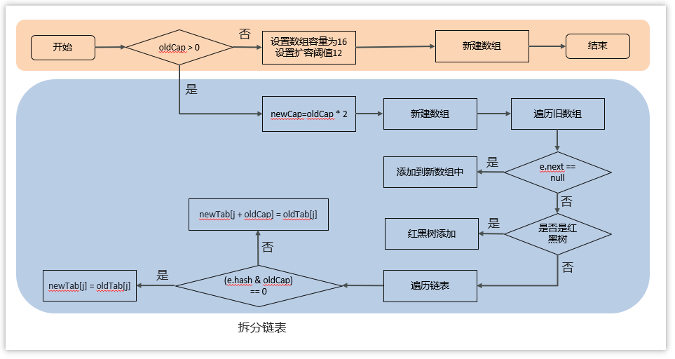
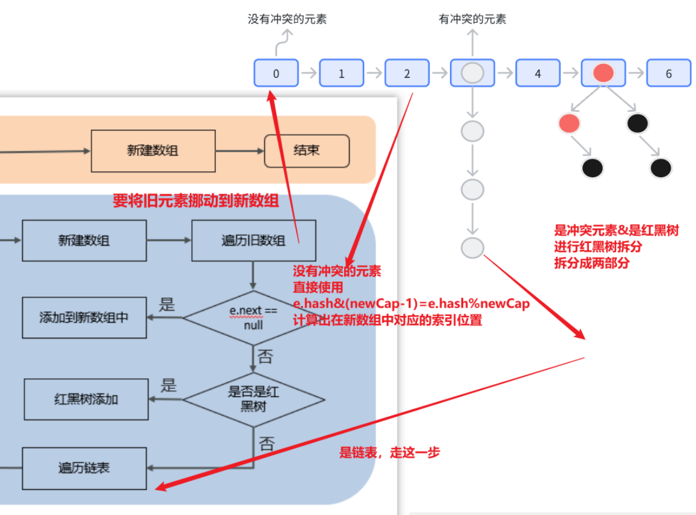

# HashMap

## HashMap的put方法的具体流程

> 1. 判断键值对**数组table是否为空或为null**，否则执行**resize()进行扩容（初始化）**
>
> 2. 根据键值key的hash值计算得到数组索引i
>
> 3. 判断table[i]==null，条件成立，**直接新建节点添加**
>
> 4. 如果table[i]==null ,不成立
     >
     >    4.1 判断table[i]（当前位置）的key一样，**如果相同直接覆盖value**
     >
     >    4.2 **如果不同**：判断table[i] （当前这个桶存储了一个红黑树的头结点）是否为treeNode，即table[i] 是否是红黑树，**如果是红黑树，则直接在树中插入键值对**
     >
     >    4.3 **如果不是红黑树，那就是链表，遍历table[i]记录的链表，准备在链表的尾部插入数据**，然后判断链表长度是否大于8，大于8的话把链表转换为红黑树，遍历过程中若发现key已经存在直接覆盖value
>
> 5. 插入成功后，判断实际存在的键值对数量size是否超多了**最大容量threshold（数组长度*0.75）**，如果超过，进行扩容。

## HashMap扩容

> **ps：什么时候需要HashMap的扩容？**
>
> 首次添加元素的时候以及容量到达阈值的时候

>- 在**添加元素或初始化的时候需要调用resize方法进行扩容**，**第一次添加数据初始化数组长度为16**，以后每次每次扩容都是达到了扩容阈值（数组长度 * 0.75）
>- 每次扩容的时候，**都是扩容之前容量的2倍；**
>- 扩容之后，会新创建一个数组，**需要把老数组中的数据挪动到新的数组中**
>- 没有hash冲突的节点，则直接使用 **e.hash & (newCap - 1) 计算新数组的索引位置**（对数组的新长度取模）
>- 如果是红黑树，走红黑树的添加（也是遍历红黑树的每个节点，重新计算每个节点的位置）
>- 如果是链表，则需要遍历链表（的每个节点），判断(e.hash & oldCap)是否为0，如果为0，该元素停留在原始位置，如果不为0，移动到**原始位置+旧容量**这个位置上
   >  - **（也就是：一部分节点的索引不变，另一部分索引为“原索引+旧容量”）**
>  - 节点迁移示意图：**可以看到同一条链表里的元素不一定会全部都在新数组同一个“桶”里**，红黑树也是如此，所以可能红黑树
>  - 会出现被拆分的情况，如果红黑树的树节点小于6，那么就会退化成一个链表
>  - 

扩容的流程：

