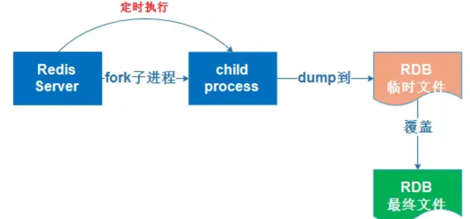
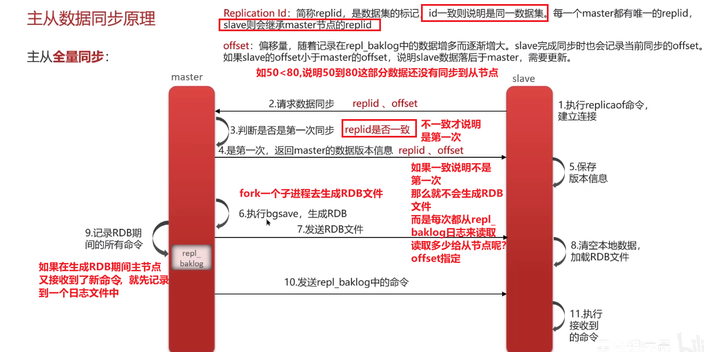

# Redis持久化

> 有RDB和AOF两种方式
>
> - RDB是一个快照文件，它可以在指定的之间间隔内，把内存中的数据集写到磁盘，也就是保留某个时间点的数据集，
    >   - redis实例宕机恢复数据的时候，用RDB的快照文件恢复是比较快的，因为它是个二进制文件，体积比较小
>
> - AOF的是个追加文件，当redis操作**写命令**的时候，都会存储这个AOF日志文件中，
    >   - （当redis实例宕机恢复数据的时候），**重做这些命令**就能恢复数据，所以用它恢复会比较慢一些，但是用它丢失的风险会小很多，**所以适用于对数据安全性较高的场景**：比如购物车、订单等关键业务
>   - 因为RDB可能会丢失某一时间间隔的数据，如果某个时间间隔变动的数据很多，那么那个时间间隔的数据变动情况可能都丢失了
>   - AOF丢失数据的风险会小很多，因为它可以设置AOF追加一个写命令就刷盘的策略
      >     - AOF丢失数据的风险在:Redis执行一个写命令，还没来得及写入AOF，就宕机了，所以可能丢失那一条命令
>
>
> 他们的原理呢：
>
> - redis要形成快照文件的时候，会从主线程Fork一个子进程来生成快照。在子进程会读取redis内存中的数据集，把数据集写入到一个【临时文件】、写入成功之后，再替换原来的RDB文件，用二进制的形式压缩
    >   - 如果在生成快照的过程中，如果有redis写操作来修改redis里的数据，就采取“copy on wirite”写时复制的策略，复制一个没有修改之前的数据副本，把数据副本保存到RDB文件中，主线程继续对原来数据进行修改，这样（主线程和子进程）互不影响
>

>
> - AOF的背后原理：
>
> - AOF则是将所有redis写命令追加到AOF文件中，再采取一些刷盘策略（每秒刷盘，每修改一次数据就同步一次，或者不同步）持久化到磁盘中，
    >
    >   **缓冲区机制**：
    >
    >   - 写操作首先会被追加到 AOF 缓冲区中，而不是直接写入磁盘。AOF 缓冲区是 Redis 的内存区域，用于暂存需要写入到 AOF 文件中的命令。
>   - 之后，Redis 会根据配置中的 `fsync` 策略，将缓冲区中的数据写入磁盘，确保数据的持久化。
    >
    >   **`fsync` 策略**：
    >
    >   - Redis 提供了三种 刷盘策略 策略，用来控制 AOF 缓冲区的数据写入磁盘的频率：
          >     - **`always`**：每次有新命令写入 AOF 缓冲区时，立即调用 `fsync`，将数据写入磁盘。这种方式最安全，但性能较低，因为每个写操作都会触发磁盘写入。
>     - **`everysec`**：每秒执行一次 `fsync`，在 Redis 服务器的主线程之外的后台线程执行。大部分情况下，这种方式是性能与安全性的折中方案，可能会丢失最近一秒的数据。
>     - **`no`**：不主动调用 `fsync`，由操作系统决定何时将数据从缓冲区写入磁盘。这种方式性能最好，但存在数据丢失的风险。
>
> **AOF和RDB不同的一点还有：**
>
> - 如果当AOF文件过大，那么用AOF恢复数据时耗时太久，就要对它进行压缩【也就是AOF重写机制】，也是fork一个子进程来执行：：也就是先读取当前redis数据库中的所有键值对，并逐一把键值对转换成一条命令，也就是把对应键值对更新到最新的一条命令，（之前的历史版本忽略），再把这些命令搬运到新的AOF文件中

