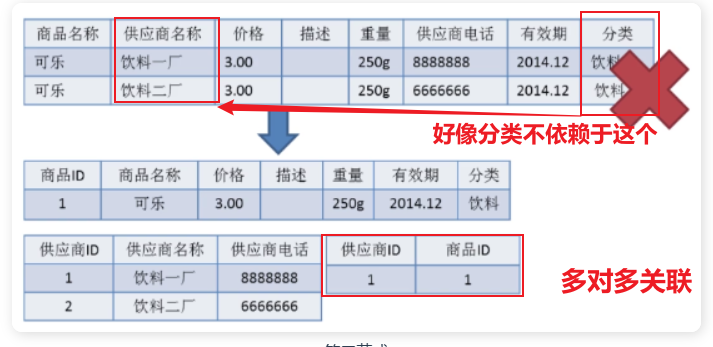

# 1.待定名称

## 总图

## 什么是元组, 码（键）, 候选码, 主码（主键）, 外码, 主属性, 非主属性？
- 元组:表（关系是一张表）中的一行数据
- 码（键）：可以唯一标识元组合的一个属性/多个属性组合
- 候选码：可能成为主码（键）的码，它可以唯一标识元组但最后不一定成为主码
- 主码：可以唯一标识元组的码，从候选码中选出来的，例如id
- 外码：是当前这张表中的一个属性，同时它关联另一张表的主码
- 主属性：构成主码的属性（如果主码有2个属性的话，主属性就有2个）
- 非主：一个元组的属性中，除了主属性之外的属性

## 什么是数据库范式（what）
数据库范式是一组规则，来约束数据库的表结构

### 为什么需要数据库范式（why）
减少数据冗余，节省存储空间

### 有哪些数据库范式，如何区分？（what）
- 第一范式（默认）：**属性不可再分**。基本关系数据库创建的每一张表都满足，
- 第二范式要求**非主属性对任何候选键都是完全依赖的**，不出现部分依赖的情况
> 考虑一个订单表，其中包含订单号、产品编号和产品描述。如果产品描述只依赖于产品编号而不依赖于订单号，
> 那么该表就不符合第二范式，因为产品描述只依赖于候选键的一部分。
> 为了符合第二范式，可以将产品描述与产品编号分离出来，
> 建立一个独立的产品表，使得产品描述完全依赖于产品编号.

-- 第三范式：要求**非主属性不能对候选码产生传递依赖**，也就是说非主属性直接依赖于候选键，而不是依赖于其他非主属性

> 例如，在一个订单表中，除了订单号和产品编号之外还有客户姓名和客户地址。如果客户地址依赖于客户姓名而不是订单号，则存在传递依赖。 为了符合第三范式，应该将客户姓名和客户地址分离出来，建立一个独立的客户表，使得客户地址直接依赖于候选键（可能是客户编号），而不是依赖于客户姓名。

> 比如在关系 R(学号 , 姓名, 系名，系主任)中，学号 → 系名，系名 → 系主任，所以存在非主属性系主任对于学号的传递函数依赖，所以该表的设计，不符合 3NF 的要求。 该如何修改？(how)
>
> **直接分解关系**：

关系R(学号, 姓名, 系名, 系主任)，存在非主属性系主任对于学号的传递函数依赖，因此不符合第三范式（3NF）的要求。

可以将关系R拆分为两个关系：

1. 学生关系（学号, 姓名, 系名）：这个关系包含了学生的学号、姓名以及所属系名。
2. 系信息关系（系名, 系主任）：这个关系包含了系名和该系的系主任。

这样，每个关系都符合第三范式的要求，不存在传递依赖。学生关系中，系名直接关联到系信息关系的系名，而不再通过系主任产生传递依赖。系信息关系中，系主任直接关联到系名，也不存在传递依赖。

修改后的关系如下：

    1. 学生关系：

| 学号 | 姓名 | 系名     |
| ---- | ---- | -------- |
| 1    | 张三 | 计算机系 |
| 2    | 李四 | 数学系   |
| 3    | 王五 | 物理系   |

    1. 系信息关系：

| 系名     | 系主任 |
| -------- | ------ |
| 计算机系 | 王老师 |
| 数学系   | 张老师 |
| 物理系   | 李老师 |

分别解决什么问题？

- **一：属性不可再分**
- **二：进一步消除数据冗余**
- **三：更近一步消除数据冗余，保证数据独立性和一致性**

#### BCNF

- BCNF是第三范式（3NF）的一个更严格的形式

- 对于每一个函数依赖，左边的属性集必须包含这个表的所有候选键

- 考虑一个关系模式 `R(教师, 课程, 课程时间)`，其中教师和课程的组合可以唯一标识一条记录，所以 `(教师, 课程)` 是主键。

  假设存在如下依赖关系：

  - 教师 → 课程时间

  这个依赖关系表明，每个教师只能在特定时间教授课程。

  按照第三范式，该表是符合要求的，因为：

  - 没有部分依赖，课程时间是完全依赖于候选键 `(教师, 课程)`。
  - 也不存在传递依赖，所有属性都直接依赖于候选键。

  但该表不符合BCNF，因为：

  - 教师 → 课程时间 违反了BCNF的定义。这里教师并不是表的**超键**，但它却决定了课程时间。

  - 如何将这个关系模式转换为符合BCNF？

    我们可以将关系模式拆分为两个关系**（分表）**：

    1. `R1(教师, 课程时间)`：教师与课程时间的关系。
    2. `R2(教师, 课程)`：教师与课程的关系。

    这样，每个关系都符合BCNF，因为在 `R1` 中，教师是超键；在 `R2` 中，教师和课程的组合是超键。

- 超键和候选键的关系：

  - **主键**：主键（Primary Key）是从超键中选择的一个，它在表中唯一标识每一行，并且通常选择最小的属性组合（即没有多余属性）。

    **候选键**：候选键（Candidate Key）是指那些有可能成为主键的超键。如果一个超键是最小的（无法去掉任何一个属性而仍然保持唯一性），它就是候选键。
## 第几范式能消除数据冗余？
- 第三范式
- why？
  - 
## 数据库几大范式分别解决了什么问题？
- **一**：属性不可再分
- **二**：进一步消除部分依赖，确保每个非主属性完全依赖于整个主键
- **三**：消除传递依赖，保证非主属性只直接依赖于主键，而不依赖于其他非主属性
