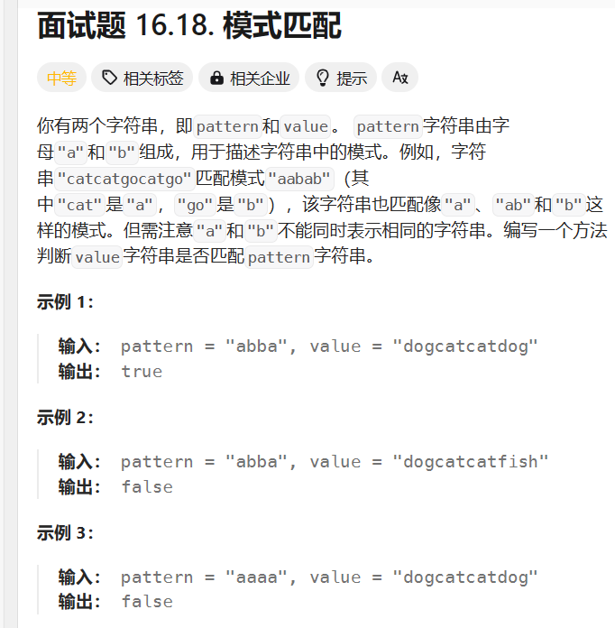

## LRUCache算法
## 输入
第一行 N K（N为缓存容量，K为接下来的行数）
- 接下来N行：
- 例： A 103（A为类型，103为数据，类型有（A：添加，Q：查询，D：删除）

## 输出最后缓存中的元素

用例：
- 输入
  - 2 5
  - A 103
  - A 102
  - A 102
  - Q 103
  - A 104
- 输出：
  - 103 104
- 解释
> 103 102正常添加，第三步添加102，102已存在，且缓存中的102、103都没被使用过，所以这一步没有变动
> Q 103查询103一次，使得缓存中103的使用次数+1，A 104要添加104，要把最近最少使用的102换出，加入104
>

## 自认为难点
### 要新写一个LRUCache类吗？
  - 写不了，提示编译报错：LRUCache是pubilc类，应该写在LRUcache.java
    - 尝试改成private但也报错
    - 
### 每行输出字母和数字如何获取出字母？： A 103
- 按照一整行都是string输入处理吗？
  - 尝试了，很麻烦

## 模式匹配

### 输入
- 2(A2(N)) ：A表示字母（大小写都有),N表示数字
- ARB23C78N90

### 输出
- B23C78
### 力扣的模式匹配没有括号

