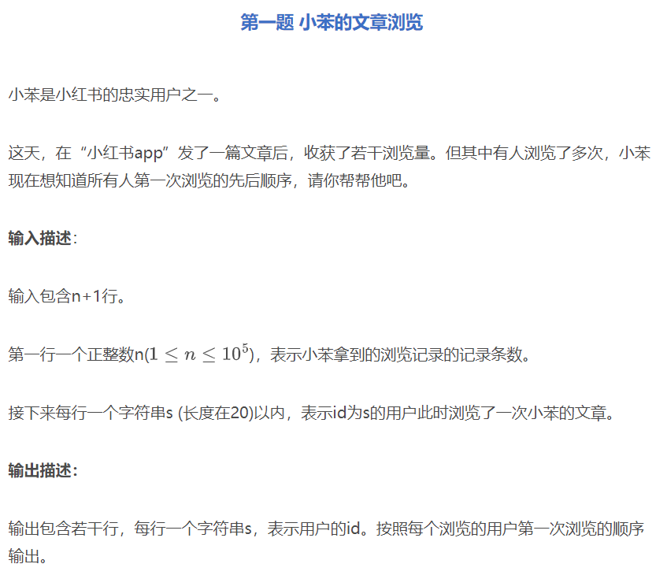
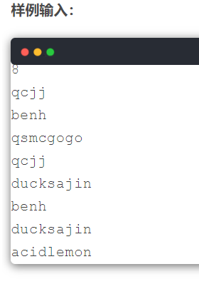
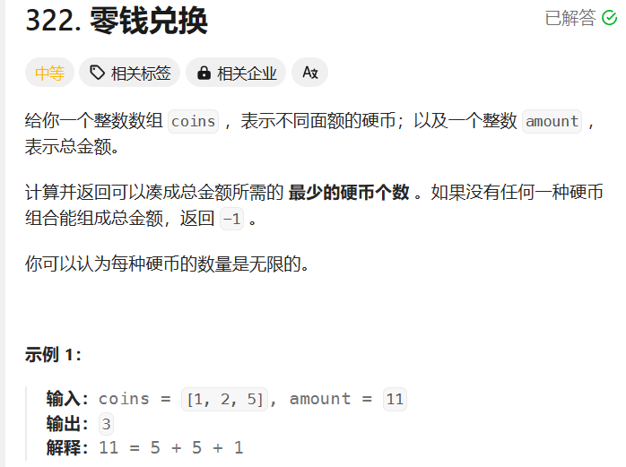

# 小红书

## 题目1-文章浏览



### 题目建模
- 对输入进来的字符串去重，不改变相对顺序

### 代码

```java
import java.util.*;

public class Main {
    public static void main(String[] args) {
        Scanner scanner = new Scanner(System.in);

        int n = scanner.nextInt(); // 记录条数
        scanner.nextLine(); // 换行

        Map<String, Integer> firstViews = new LinkedHashMap<>(); // 用于存储第一次浏览的用户及其顺序

        for (int i = 0; i < n; i++) {
            String userId = scanner.nextLine();

            // 如果用户ID第一次出现，则记录下来
            if (!firstViews.containsKey(userId)) {
                firstViews.put(userId, i);
            }
        }

        // 按照浏览的先后顺序输出第一次浏览的用户ID
        for (String userId : firstViews.keySet()) {
            System.out.println(userId);
        }
    }
}

```

### 为什么用LinkedHadhMap而不是HashMap
- 因为HashMap肯呢个会内部优化，不能保证存储的顺序与插入的顺序一致

### 为什么要加一个scanner.nextLine() 换行
- 因为输入的用例是这个格式：
    
- int n = scanner.nextInt();只能读取到整数，后面的换行无法处理，如果不加这个，那么整数后面的换行就会当做一个字符串的一部份


## 涨粉问题

### 题目建模

n个账号，每一个账号对应一个粉丝数，要求增和达到x的最小账号个数

### 代码

```java

package org.example;
import java.util.Arrays;
import java.util.Scanner;
public class Main {
    public static int minFansCount(int[] a, int numberOfAccounts, int targetAmount) {
        int MAX = targetAmount + 1; // 不可能做到的值
        int[] dp = new int[targetAmount + 1];
        Arrays.fill(dp, MAX);
        // 边界情况
        dp[0] = 0;
        for (int i = 1; i <= targetAmount; i++) {
            for (int j = 0; j < numberOfAccounts; j++) {
                //当前数a[j]必须要<=当前目标i
                if (a[j] <= i) {
                    //dp数组：
                    // 值：题目要求的答案，也就是账号数，
                    // 下标：目标值，最后目标值要取得到target
                    //对于当前账号j：1.不发 dp[i]=dp[i],2.发一次：dp[i]=dp[i-a[j]/2]+1,3.发多次：dp[i]=dp[i-a[j]]+1
                    dp[i] = Math.min(dp[i], Math.min(dp[i - a[j]] + 1, dp[i - a[j] / 2] + 1));
                }
            }
        }
        return dp[targetAmount] > targetAmount ? -1 : dp[targetAmount];
    }
    public static void main(String[] args) {
        Scanner scanner = new Scanner(System.in);

        // n个账号
        int numberOfAccounts = scanner.nextInt();

        // 目标粉丝数
        int targetAmount = scanner.nextInt();

        int[] accountValues = new int[numberOfAccounts];
        for (int i = 0; i < numberOfAccounts; i++) {
            accountValues[i] = scanner.nextInt();
        }
        int res = minFansCount(accountValues, numberOfAccounts, targetAmount);
        System.out.println(res);
    }
}

```

### 细节，类比零钱兑换



```java
class Solution {
    public int coinChange(int[] coins, int amount) {
        int max=amount+1;//先设置为不可能的最大值，以便于min函数求值
        int[]dp=new int[amount+1];
        Arrays.fill(dp,max);
        // 边界情况
        dp[0]=0;
         for (int i = 1; i <= amount; i++) {
            for (int j = 0; j < coins.length; j++) {
                if (coins[j] <= i) {
                    dp[i] = Math.min(dp[i], dp[i - coins[j]] + 1);
                }
            }
        }
        return dp[amount]>amount?-1:dp[amount];

    }
}
// 操作空间：一维数组，不重复
// dp数组值：最少硬币个数，最少那就得用到（min）
// dp数组下标：构成的金额，最后要能取到amount
// 子问题：
// 对于当前硬币，不取，dp[i]=dp[i],取：dp[i]=dp[i-coin(j)]+1//不是coins【i】是因为i的范围是0_amount,amount跟操作空间的个数不一定一样
// 边界情况，dp[0]=0，
// 额外考虑，i-coins（j）>=0,则coin【j】<=i


```


## 文章组合使得某个公式最大
题目：输入n和k，接下来两行分别输入n篇文章的n个点赞数a,n个评论数b，分别表示第i篇文章的点赞数a和评论数b，也就是a[i]对应b[i]，求选取的k个文章构造出的最大优秀度，其中优秀度的定义为：选取的k个文章，将k个文章的点赞数相加*（k个文章的最小评论数），
示例 

- 4 2
- 1 2 3 4
- 3 4 2 1，
- 输出10,解释：选取第2第3篇文章就能达到这个效果


``` java
package org.example;

import java.util.Scanner;

public class Main {
static long maxExcellence = 0;

    public static void main(String[] args) {
        Scanner scanner = new Scanner(System.in);
        int n = scanner.nextInt();
        int k = scanner.nextInt();

        int[] a = new int[n];
        int[] b = new int[n];
        for (int i = 0; i < n; i++) {
            a[i] = scanner.nextInt();
        }
        for (int i = 0; i < n; i++) {
            b[i] = scanner.nextInt();
        }

        dfs(a, b, n, k, 0, 0, 0, Integer.MAX_VALUE);

        System.out.println(maxExcellence);
    }

    static void dfs(int[] a, int[] b, int n, int k, int index, int count, long sumA, int minB) {
        if (count == k) {

            maxExcellence = Math.max(maxExcellence, sumA * minB);
            System.out.println("找到一种方案"+maxExcellence);
            return;
        }

        if (index == n) return;

        System.out.println("选取这个文章："+index);
        // 选取当前文章
        dfs(a, b, n, k, index + 1, count + 1, sumA + a[index], Math.min(minB, b[index]));

        System.out.println("不选取这个文章："+index);
        // 不选取当前文章
        dfs(a, b, n, k, index + 1, count, sumA, minB);
    }
}
``` 

