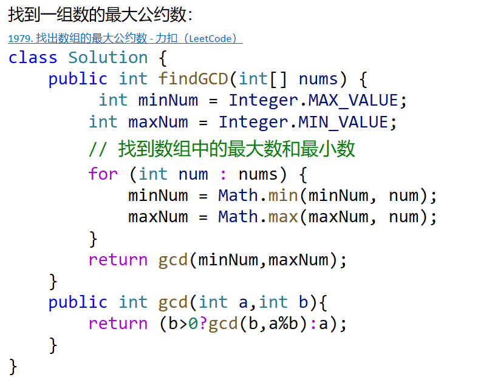

# 数学相关
### 1. 最大公约数（GCD）
#### 题目描述：
给定两个整数，求它们的最大公约数。

#### 解法：
```java
// 使用辗转相除法求解最大公约数
public static int gcd(int a, int b) {
   
    return b>0?gcd(b, a % b):a;
}

// 示例用法
public static void main(String[] args) {
    int a = 48;
    int b = 18;
    int result = gcd(a, b);
    System.out.println("最大公约数为：" + result); // 输出：最大公约数为：6
}
```

### 2. 素数判定
#### 题目描述：
给定一个整数，判断是否为素数。

#### 解法：
```java
// 素数判定
public static boolean isPrime(int n) {
    if (n < 2) {
        return false;
    }
    for (int i = 2; i * i <= n(i<=n/i更快); i++) {
        if (n % i == 0) {
            return false;
        }
    }
    return true;
}

// 示例用法
public static void main(String[] args) {
    int number = 17;
    boolean result = isPrime(number);
    System.out.println(number + " 是否为素数：" + result); // 输出：17 是否为素数：true
}
```


### 3. 斐波那契数列
#### 题目描述：
求斐波那契数列的第 n 项。

#### 解法：
```java
// 求斐波那契数列的第 n 项
public static int fibonacci(int n) {
    if (n <= 1) {
        return n;
    }
    int a = 0, b = 1;
    for (int i = 2; i <= n; i++) {
        int temp = a + b;
        a = b;
        b = temp;
    }
    return b;
}

// 示例用法
public static void main(String[] args) {
    int n = 8;
    int result = fibonacci(n);
    System.out.println("斐波那契数列第 " + n + " 项为：" + result); // 输出：斐波那契数列第 8 项为：21
}
```