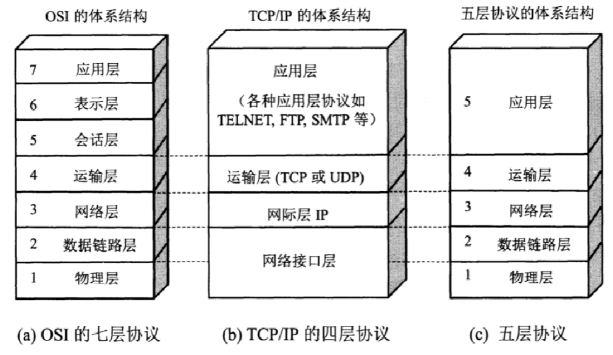

# 计算机网络
### 7层、4层、5层模型（网络体系结构）

> OSI 是理论上的网络通信模型，TCP/IP 是实际应用层面上的网络通信模型，五层结构是为了方便理解和记忆

> 七层模型各层作用：
>
> - **应用层**：处理和用户交互的层，为用户提供各种网络服务，例如，Web 浏览器、FTP 客户端和服务器、电子邮件客户端等。
> - **表示层**：负责数据编码格式的转换、压缩和加密。例如，确保数据从一种编码格式转换为另一种。（如图片压缩成JPEG）
> - **会话层**：管理网络上主机节点之间的会话，负责建立、维护和终止会话。例如，建立一个会话令牌，以便在网络上的两个节点之间传递。
> - **传输层**：提供端到端的通信服务，保证数据的完整性和正确顺序。这一层包括 TCP 和 UDP 等。
> - **网络层**：负责在多个网络之间进行数据包传输和路由选择，这层使用的是 IP（Internet Protocol）协议。
> - **数据链路层**：在物理连接中提供可靠的传输，负责建立和维护两个相邻节点间的链路。包括帧同步、MAC（媒体访问控制）。
> - **物理层**：负责在物理媒介上实现原始的数据传输，比如电缆、光纤和无线信号传输。涉及的内容包括电压、电缆的规格和传输速率等。

> 发送方的数据包从上层到下层层层封装，每一层都加上自己的报头5，最后变成物理层的01串
>
